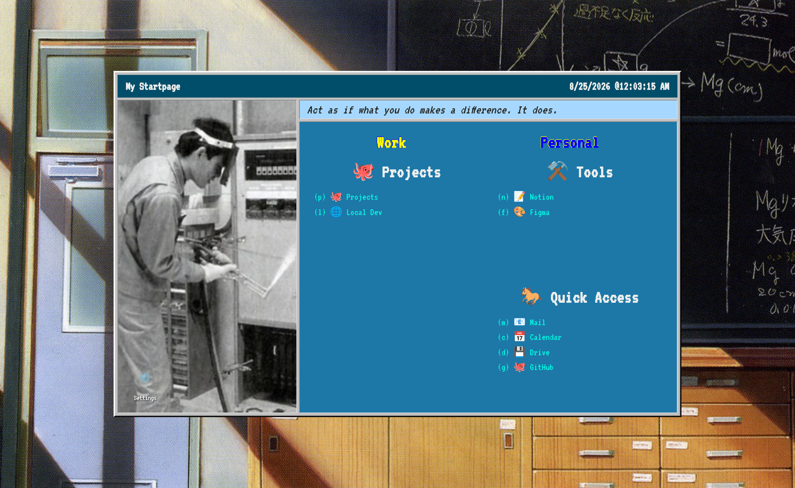

# Startpage

[](https://github.com/chedieck/startpage/actions/workflows/ci.yml)
[](LICENSE)

A keyboard-driven browser start page. Every link has a single-key shortcut, links are grouped into four boxes, and boxes are grouped into tabs.



Everything you see comes from `~/.config/startpage/config.json`, read fresh on every page load, so changing your links is a matter of editing that file — or using the settings window — and hitting refresh. Nothing is sent anywhere: no account, no database, no telemetry. The first run writes a sample config for you.

## Quick start

```bash
git clone https://github.com/chedieck/startpage.git
cd startpage
npm install
npm run dev
```

Open <http://localhost:5173>.
For daily use you probably want it running in the background — see [Installing as a service](#installing-as-a-service).

## Keybinds

The page listens for bare keypresses — no `Ctrl`, no `Alt`:

| Key           | Does                                                   |
| ------------- | ------------------------------------------------------ |
| `Tab`         | Next tab                                               |
| `Shift`+`Tab` | Previous tab                                           |
| any other key | Opens the link that claims that key in the current tab |
| `Esc`         | Closes the settings window                             |

Tab cycling lives on `Tab` so that every printable key stays yours to assign.
Shortcuts are case-sensitive (`g` and `G` are two different links) and only have to be unique **within a tab**, so `c` can be Calendar on one tab and Client on another.
An empty shortcut (or `-`) lists the item without binding a key.
If two links in the same tab claim the same key, the first wins and the other is drawn without a key; the settings window highlights both.

Links open in the same tab, replacing the start page.
Tick **Open links in a new tab** in Settings → General, or set `"openInNewTab": true`, if you would rather keep it open.

## Configuring

Click the **Settings** icon in the bottom-right corner of the sidebar photo, or edit `~/.config/startpage/config.json` directly:

```json
{
	"title": "My Startpage",
	"quote": "Act as if what you do makes a difference. It does.",
	"openInNewTab": false,
	"quickAccess": {
		"title": "Quick Access",
		"icon": "🐎",
		"items": [{ "url": "https://mail.google.com", "shortcut": "m", "name": "📧 Mail" }]
	},
	"tabs": [
		{
			"title": "Work",
			"icon": "💼",
			"sections": [
				{
					"title": "Projects",
					"icon": "🐙",
					"items": [{ "url": "https://github.com", "shortcut": "p", "name": "🐙 Projects" }]
				}
			]
		}
	],
	"backgroundImage": "/api/images/background.jpg",
	"frameContentImage": "/api/images/frameContent.png"
}
```

| Field               | Meaning                                                   |
| ------------------- | --------------------------------------------------------- |
| `title`             | Text in the window's title bar                            |
| `quote`             | The one-liner in the light blue strip                     |
| `quickAccess`       | A section pinned to the bottom-right box of **every** tab |
| `tabs`              | The tabs, in display order                                |
| `tabs[].sections`   | Up to three sections per tab; see the layout below        |
| `backgroundImage`   | Wallpaper behind the window (optional)                    |
| `frameContentImage` | Photo in the window's left sidebar (optional)             |
| `openInNewTab`      | Open links in a new tab instead of navigating away        |

Each item is `{ "name": ..., "url": ..., "shortcut": ... }`.
The `name` is displayed as-is, so leading emoji or Nerd Font glyphs are just part of the name.

Set `STARTPAGE_CONFIG` to put the config somewhere else. Uploaded images always live in an `images/` directory next to it.

### The four boxes

Every tab is a 2×2 grid: the first three boxes are the tab's own sections, the fourth is always Quick Access.

```
┌──────────────┬──────────────┐
│ sections[0]  │ sections[1]  │
├──────────────┼──────────────┤
│ sections[2]  │ quickAccess  │
└──────────────┴──────────────┘
```

A section you leave out renders as empty space.
A list too long to fit continues in a second column inside the same box, and shrinks its text if even that is not enough.
The whole window scales as one unit, so browser zoom changes how big it looks and never how it is laid out.

### Images

The wallpaper and the sidebar photo default to `static/background.png` and `static/window-content.png`.
To use your own, open Settings → Customization and pick a file: it is copied to `~/.config/startpage/images/` and referenced from your config, and **Use default** removes the override.
By hand, set `backgroundImage` / `frameContentImage` to any path or URL the browser can load.

## Setting it as your home page

Run the app somewhere stable (below), then point your browser at it.

**Firefox** — Settings → Home → _Homepage and new windows_ → Custom URLs → `http://localhost:51991`.

**Chrome / Chromium** — Settings → On startup → _Open a specific page_ → `http://localhost:51991`.

Neither browser lets you replace the new-tab page without an extension.

`make nginx` puts the page on <http://startpage.local> so you never type a port again; it needs nginx and asks for sudo. `make nginx DOMAIN=home.local` picks another name, `make nginx-uninstall` undoes it.

## Installing as a service

The `Makefile` installs the built app into `/opt/startpage` and registers a **user** systemd unit, so it starts with your session and needs no root beyond writing to the prefix:

```bash
make install          # build, copy to /opt/startpage, install the unit
make enable start     # run it now and on every login
make status           # check on it
make update           # rebuild and restart after pulling changes
make nginx            # optional: serve it at http://startpage.local
make uninstall        # remove all of it
```

Defaults are `PREFIX=/opt/startpage`, `PORT=51991` and `HOST=127.0.0.1`; override them on the command line, e.g. `make install PORT=8080`.
`HOST=127.0.0.1` deliberately keeps the page off your network — it is a page of your personal links, and its config endpoint is unauthenticated, so do not expose it to anything you do not trust.

## Development

```bash
npm run dev      # dev server with hot reload
npm run build    # production build into build/
npm run preview  # serve that build
npm run check    # svelte-check / TypeScript
npm run lint     # prettier + eslint
npm run format   # rewrite files with prettier
```

Point the app at a throwaway config while hacking on it:

```bash
STARTPAGE_CONFIG=/tmp/startpage.json npm run dev
```

| Path                                     | What                                       |
| ---------------------------------------- | ------------------------------------------ |
| `src/routes/+page.svelte`                | The page itself: layout, keybinds, styling |
| `src/lib/components/ConfigEditor.svelte` | The settings window                        |
| `src/lib/types.ts`                       | Config shape and the tab → grid mapping    |
| `src/lib/server/config.ts`               | Reading/writing the config file            |
| `src/lib/default-config.json`            | What a fresh install gets                  |
| `resources/`                             | systemd unit and nginx snippets            |

## Credits

The interface font is [VT323](https://fonts.google.com/specimen/VT323) and the list font is [JetBrains Mono Nerd Font](https://github.com/ryanoasis/nerd-fonts), both under the SIL Open Font License; their license files sit next to them in `static/fonts/`.

## License

Copyright (C) 2026 chedieck. Licensed under [AGPL-3.0-or-later](LICENSE): if you run a modified version of this as a service that other people can reach, they are entitled to its source.
